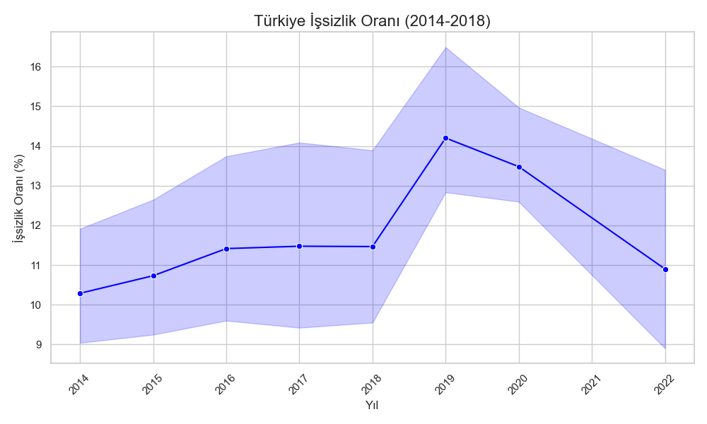

# Türkiye İşgücü Piyasası Analizi

Bu proje, Türkiye İstatistik Kurumu (TÜİK) açık verilerini kullanarak 2014–2018 dönemi işsizlik oranlarını analiz etmektedir.  

## Kullanılan Teknolojiler
- Python  
- Pandas (veri temizleme ve analizi)  
- Matplotlib & Seaborn (grafik ve görselleştirme)  

## Proje Açıklaması
- Excel formatındaki resmi işsizlik verisi okunmuştur.  
- Gereksiz başlık ve açıklama satırları temizlenmiştir.  
- İşsizlik oranları yıllara göre görselleştirilmiş ve zaman trendi oluşturulmuştur.  
- Elde edilen grafik, politika değerlendirmeleri ve sunumlarda kullanılabilir.  

## Çıktı / Örnek Grafik

## Dosyalar
- `main.py` → Analiz ve grafik oluşturma kodu  
- `issizlik.xls` → TÜİK veri dosyası  
- `issizlik_grafik.png` → Oluşturulan grafik  